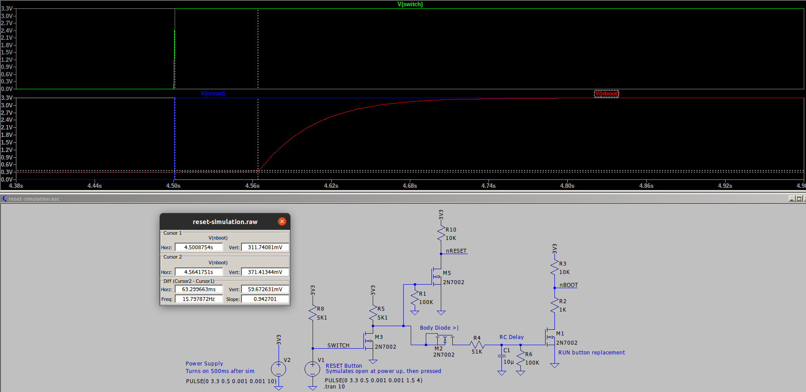

# Sea-Picro

Sea-Picro is a RP2040 based board in the Arduino Pro Micro form factor. Like [Sea-Micro](https://github.com/joshajohnson/sea-micro#sea-micro), it's designed to be a drop in replacement for keyboards wanting an upgrade from ATmega32u4 based pro micros.

There are two variants:
- Pro micro pinout, with onboard RGB LED and reset button
- Elite-C pinout, with dedicated 5V RGB LED pin, but without a reset button

**Sea-Picro EXT**

**Sea-Picro RST** (test points will be removed once reset circuit validatedd)

## Features
- Compatiable with any pro micro based keyboard (requires new firmware)
- RP2040 microcontroller, with dual M0+ processors at up to 133MHz
- Mid mount USB-C connector, which is low profile and can't be ripped off
- Optional [Elite-C](https://deskthority.net/wiki/Elite-C) style pinout, adding an additional 5 IO for large keyboards
- Single button reset / bootloader circuit which changes behaviour based on how long it's held (RP2040 usually requires two buttons to flash new firmware, making it challenging when installed upside down in a keyboard)
- ROM bootloader which prevents board from being bricked
- Onboard power LED, along with a WS2812 LED for use with CircuitPython / as a status indicator on the RST version. EXT version has a 5V level shifter and extra pin to drive strings of WS2812 LEDs.
- IO pinout identical to the [Sparkfun RP2040 Pro Micro](https://www.sparkfun.com/products/18288)

## Manufacturing
Sea-Picro was designed with the goal of being assembled at JLCPCB, as it will ease sourcing for those who don't want to assemble the PCBs at home.

As such all of the components can be sourced from JLC's SMT parts library, with 8 of the components being basic parts, and 11 being extended. In quantity 50, each board comes out to $6 USD / $8 AUD + freight. (8th March 2022)

## One Button Reset / Bootloader Circuit

One of the tricky things with the RP2040 is that unlike the pro micro, to update the firmware you need to use two buttons in sequence to put it into the bootloader. To get around this, I've designed a circuit which when tapped for less than 500ms will reset the board, but when held for 2 seconds or more will jump into the bootloader. 

At the time of writing the circuit as only been simulated, so is yet to be confirmed as working and may require tweaking of some component values for it to work properly. If you want to have a play with the simulation the LTSpice file are in `simulation/` along with screenshots of it's output for different switch times.

Below is a screenshot of the circuit and simulation, showing a 60ms delay in nCS being pulled high after reset goes high, which is required to jump into the bootloader. (R1 has been removed as it's redundant, but images have not been updated).

## Contributing

If you want to download the project, ensure you clone `--recursive` as my parts library is pulled in as a submodule.

For any suggestions, areas of improvement, or problems you've found, please open an issue. I'm keen to get feedback on how the board could be altered to suit more people, so please don't hesitate to suggest a change.

## Revision History
- V0.1 was more or less a clone of the Sparkfun RP2040, and was used as a refrence point for development. Tested and working, but not recomended for use.
- V0.2 added the one button reset / bootloader circuit, along with a number features and DFM improvements. Development is ongoing.

### Revision 1 

